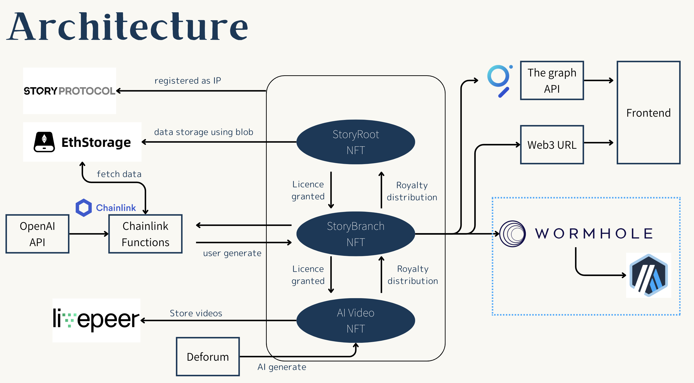

# Story Telller

## Tagline

On-chain interactive content generatioin and incentivised by IPFi.
Effortless and Engaging Interactive Content Creation, Automatically Integrated with an IP Registry.

## The problem it solves

We believe the best crypto IP emerges from bottom-up content, exemplified by Loot NFT.

Yet, content creation is challenging for many, and there’s no system for tracking user interactions.
Thus, a copilot and IP registry are needed to support bottom-up IP development.

StoryTeller addresses this by offering a ChatGPT-powered gaming prompt registry. Users interact with prompts on-chain, and such content is archived using Story Protocol as IP, serving as the gateway to IP Finance, which incentivizes creators.

## Technologies we used

### Story Protocol

A custom smart contract interacts with Story Protocol's IP registration, licensing, and remix capabilities. User-created content becomes automatically trackable through Story Protocol, which could serve as the gateway to IP Finance (IPFi). This is a critical component of the incentive design for bottom-up IP creation and management.

### ETHStorage

Upload large prompt data into an EIP-4844 blob utilizing the ETHStorage SDK. Large on-chain storage is essential for the creation of interactive content. All smart contract data is configured for Web3URL, enabling efficient retrieval of dynamic on-chain game content.

### Chainlink

Chainlink's function serves as a gateway to connect smart contracts with artificial intelligence. We utilize Chainlink functions to enable our backend access, aggregating previous gaming activity and generating new content using the OpenAI API.

### Livepeer

We have streamlined on-chain game creation and AI video generation with stable diffusion deforum, subsequently uploading it to Livepeer. This process facilitates the registration of the content as derivative NFTs. These videos are easier to share, which is crucial for attracting more users to join the ecosystem

### The Graph

The Graph tracks NFTs created within the gaming smart contract, simplifying development by aggregating all activity through a newly dedicated graph.

## Links

### Live APp

https://2024-eth-denver.vercel.app/

### Github

https://github.com/taijusanagi/2024-eth-denver

## Video Demo

TBD
