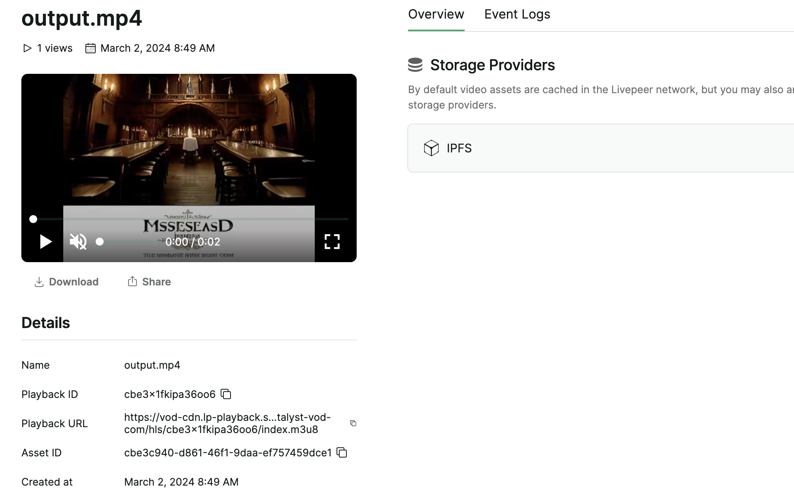

# Livepeer Integration

We have streamlined on-chain game creation and AI video generation with stable diffusion deforum, subsequently uploading it to Livepeer. This process facilitates the registration of the content as derivative NFTs. These videos are easier to share, which is crucial for attracting more users to join the ecosystem.

## Detail

### Backend

https://github.com/taijusanagi/2024-eth-denver/blob/main/app/src/pages/api/create-video.ts

- Generate prompt based on the on-chain game activity
- Use Deforum API to make text-to-video

### Frontend

https://github.com/taijusanagi/2024-eth-denver/blob/main/app/src/app/page.tsx#L495

- convert generated url to file
- Upload into Livepeer, and it can be checked in livepeer studio
- https://vod-cdn.lp-playback.studio/raw/jxf4iblf6wlsyor6526t4tcmtmqa/catalyst-vod-com/hls/cbe3x1fkipa36oo6/index.m3u8

## Challenges

- We use @livepeer/react v3 because it is bit difficult to figure out how to use v4
- We successfully create AI video using Stable Diffusion and Deforum and uploaded to Livepeer, however sharing function is needs to be build future to make it good.
